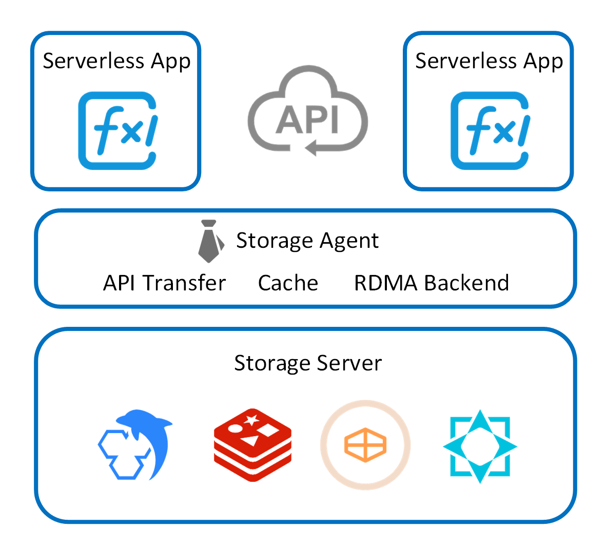
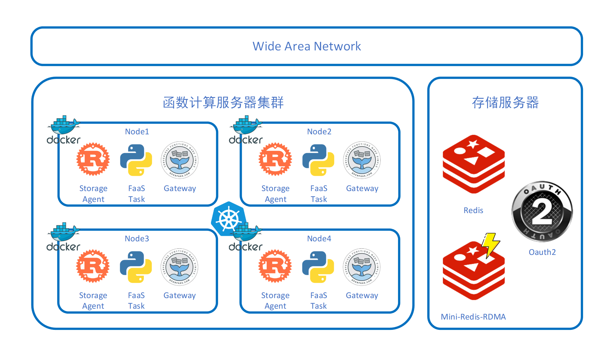

### 项目简介
本项目为面向Serverless场景的存储代理，致力于简化Serverless应用使用存储功能的方式，同时方便存储平台的变更和迁移。使得用户可以通过一套API以及简单的配置就可以方便地使用多种数据平台，并在其间进行迁移。同时在存储代理中还可以依据不同场景对存储服务做出优化，例如完成数据缓存、RDMA后端加速，或是提供函数间通信等功能。

### 实验平台
项目目前运行于两台云服务器中，其中一台作为函数计算服务器使用K3D技术模拟了K8S集群。函数计算平台借助于openfaas实现，用户FaaS函数由其调用。存储代理服务作为K8S Daemonset守护程序运行在集群中，并通过配置K8S Service将openfaas平台上FaaS函数的存储请求转发到代理中。另一台存储服务器提供数据库和认证及鉴权服务。两台服务器分别来自腾讯云和阿里云，模拟了跨云数据访问场景。

### 项目架构
内容详见
docs/architecture.md。

### 使用说明
内容详见
docs/getting_start.md。

